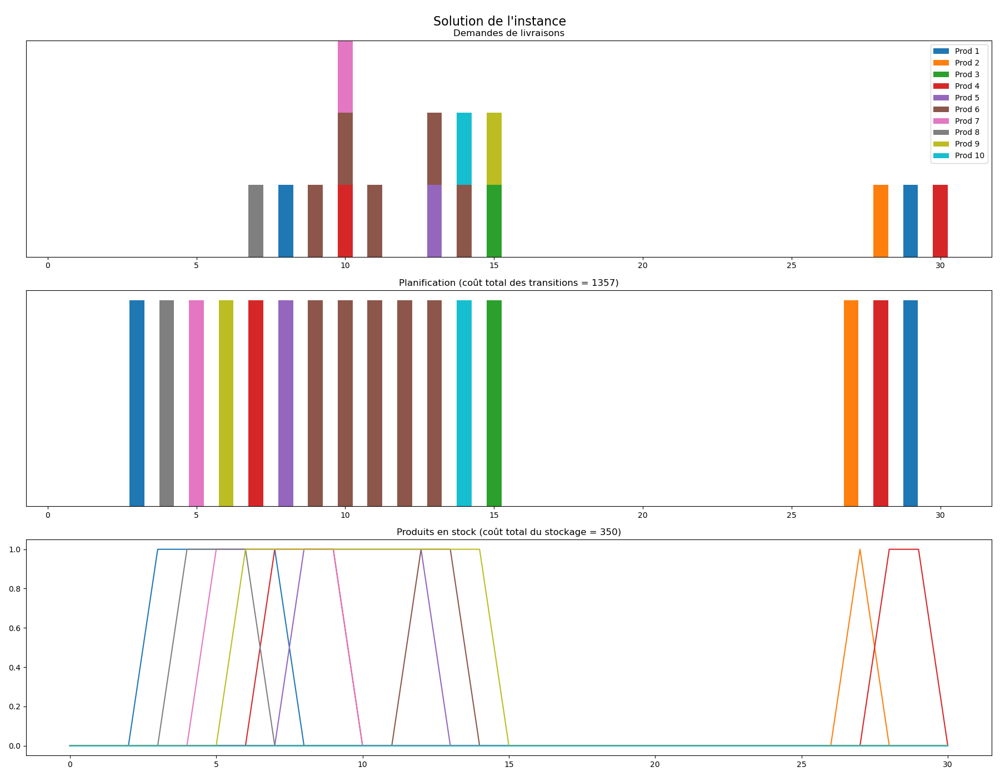
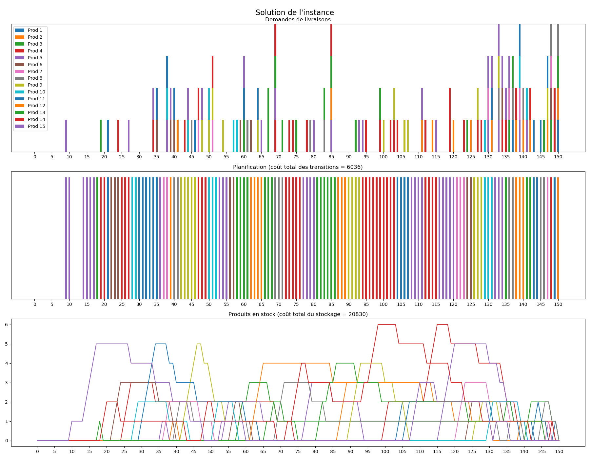
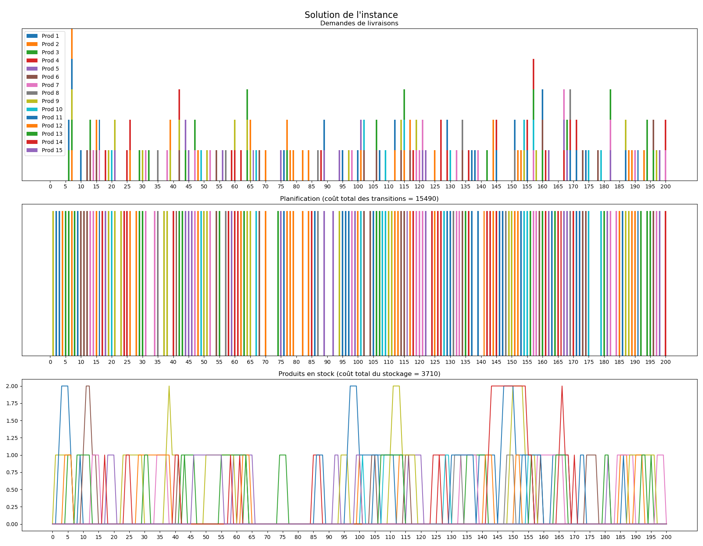

# Polytechnique Montréal - INF6102 : Configuration-Scheduling

Here is an assignement about efficient configuration scheduling in single-line production systems. In this assignment, the goal is to design a daily production schedule for a pizza manufacturing line over a given time horizon. Each day, the factory can be configured to produce a specific type of pizza or remain idle. The objective is to satisfy daily customer demands while minimizing total operational costs, which include both reconfiguration (transition) costs between product types and storage costs for early-produced items. The solution must strictly fulfill all demands on time without overproduction or delays.

There is 2 solver available :
* solver_naive.py : a naive solver adding all roads after the center as long as constraints allow.
* my_player : the implementation of my solver.

You can find a clear description of what was expected and how to run in the Assignement PDF and a succint report of my implementation in the Report PDF (both in french).

## How to run

To run a solver on an instances (aournd 5-10 min for each run):
```console
$ python main.py --agent=(solver-name).py --infile=./instances/(instance-name).txt
```

## Visualization   

Visualization instance A solution :


Visualization instance C solution : 


Visualization instance F solution :


